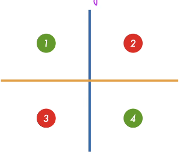
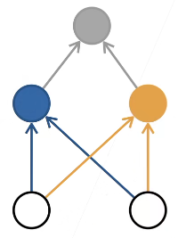
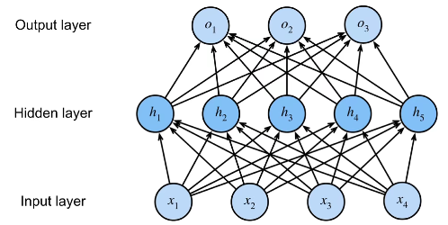

# 多层感知机

jupyter notebook: [scratch version](../notebooks/006%20多层感知机.ipynb) / [concise version](../notebooks/007%20多层感知机的简介实现.ipynb)

## 感知机

给定输入 $\boldsymbol{x}$, 权重 $\boldsymbol{w}$, 偏置 $b$, 感知机输出:
$$
o = \sigma(\left<\boldsymbol{w}, \boldsymbol{x}\right>+b), 
\sigma(x)=\begin{cases}
1,  &\text{if } x>0 \\
-1, &\text{otherwise}
\end{cases}
$$

- 二分类: 输出 $-1$ 或 $1$
    - 回归: 输出实数
    - Softmax: 输出概率

### 训练感知机

1. **INIT** $w=0$, $x=0$
2. **REPEAT**:
   - **IF** $y_i \left[\left< w, x_i\right> + b \right] \leq 0$
   - **THEN** $w \leftarrow w + y_i x_i$, $b \leftarrow b+y_i$
3. **UNTIL** all classified correctly

> 解释: $y_i \left[\left< w, x_i\right> + b \right] \leq 0$ 中, 我们可以假设某一样例左侧 $y_i > 0$ (i.e. $y_i$ 是正类):
> - 若右侧 $\left[\left< w, x_i\right> + b \right] > 0$ (i.e. $x_i$ 被预测为正类), 则相乘大于0, 进行下一个样例的预测;
> - 若右侧 $\left[\left< w, x_i\right> + b \right] < 0$ (i.e. $x_i$ 被预测为负类), 相乘小于0, 当前的 $w$ 与 $b$ 是错误的, 对其按要求进行更新.

等价于使用批量大小为 $1$ 的梯度下降. 并使用损失函数:
$$
\mathbb{l}(y, \boldsymbol{x}, \boldsymbol{w}) = \max \left(0, -y\left<\boldsymbol{w},\boldsymbol{x}\right>\right)
$$

### 收敛定理

数据在半径 $r$ 内, 余量 $\rho$ 分类两类:
$$
y(\boldsymbol{x}^T\boldsymbol{w}+b) \geq \boldsymbol{\rho}
$$
对于 $\left\Vert \boldsymbol{w} \right\Vert^2+b^2 \leq 1$, 感知机保证在 $\frac{r^2+1}{\rho^2}$ 步后收敛.

### XOR问题

感知机不能拟合XOR函数, 它只能产生线性分割面.

### Summary

- 感知机是一个而分类模型
- 求解算法等价于使用批量为 $1$ 的梯度下降
- 不能你和XOR函数

## 多层感知机

### XOR问题

|         | 1   | 2   | 3   | 4   |
| ------- | --- | --- | --- | --- |
|         | +   | -   | +   | -   |
|         | +   | +   | -   | -   |
| product | +   | -   | -   | +   |

横轴 $x$, 纵轴 $y$. 我们先将 $x$, $y$ 进入蓝色分类器和黄色分类器, 最后进入灰色的分类器, 就可以得到正确的觉果.

> 一次完成不了的话, 取两个简单函数组合就可以解决问题, 将原先的一层变成了多层.

### 单隐藏层

隐藏层大小是超参数.

#### 单分类

- 输入: $x \in \mathbb{R}^n$
- 隐藏层: $w_1 \in \mathbb{R}^{m \times n}$, $b_1 \in \mathbb{R}^m$
- 输出层: $w_2 \in \mathbb{R}^m$, $b_2 \in \mathbb{R}$
  - $h=\sigma(W_1 x + b_1)$
  - $o=w_2^Th+b_2$
  - $\sigma$ 是按元素的 **激活函数**

#### 激活函数

- Sigmoid

$$
\text{sigmoid}(x)=\frac{1}{1+\exp(-x)}
$$

- ReLU

$$
\text{ReLU}(x)=\max(x, 0)
$$

- Tanh 

$$
\text{tanh}(x)=\frac{1-\exp(-2x)}{1+\exp(-2x)}
$$

#### 多类分类

$$
y_1, y_2, \cdots, y_k = \text{softmax}(o_1. o_2, \cdots, o_k)
$$

- 输入: $x \in \mathbb{R}^n$
- 隐藏层: $w_1 \in \mathbb{R}^{m \times n}$, $b_1 \in \mathbb{R}^m$
- 输出层: $w_2 \in \mathbb{R}^{m \times k}$, $b_2 \in \mathbb{R}^k$
  - $h=\sigma(W_1 x + b_1)$
  - $o=w_2^Th+b_2$
  - $y=\text{softmax}(o)$
  - $\sigma$ 是按元素的 **激活函数**

### 多隐藏层

$$
h_1 = \sigma(W_1 x+b_1)
$$

$$
h_2 = \sigma(W_2 h_1+b_2)
$$

$$
h_3 = \sigma(W_3 h_2+b_3)
$$

$$
o=W_4h_3+b_4
$$

超参数:
- 隐藏层数
- 每层隐藏层的大小

> 如果数据复杂, 输出较少. 假设将128维输入 输出成5维的数据. 我们可以设置较多的层次, 每一层尽可能慢慢的压缩, 例如 $128 \to 64 \to 32 \to 16 \to 8 \to 5$

> 或者先将数据expand到 $256$, 在慢慢的压缩回去. 

### Sumamry

- 多层感知机是同隐藏层和激活函数来得到非线性模型
- 常用的激活函数
- 使用Softmax处理多类分类
- 超参数为隐藏的层数, 哥哥隐藏层的大小
